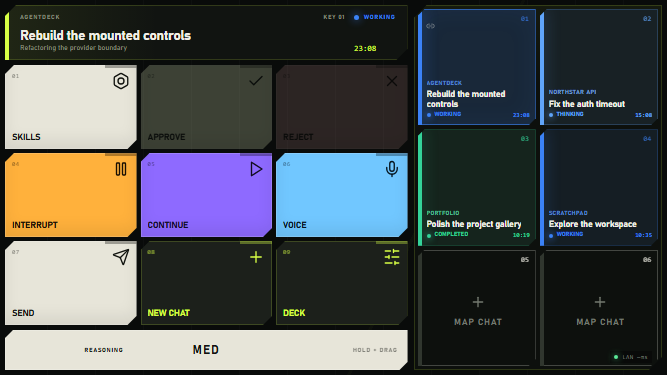

# AgentDeck

AgentDeck is an open-source, software-defined alternative to the Codex Micro: it turns an old phone
or tablet into a dedicated touchscreen control surface for AI coding agents. A lightweight Electron
host runs on your computer; the dashboard pairs over local Wi-Fi and stays synchronized over
WebSocket. There is no account, cloud service, telemetry, or chat-client UI.

AgentDeck is an independent project. It is not affiliated with or endorsed by OpenAI or Work Louder.



The interaction model is inspired by the official [Codex Micro concept](https://openai.com/supply/co-lab/work-louder/):
six glanceable chat keys, instant workflow launchers, dedicated command controls, push-to-talk,
and adjustable reasoning effort. AgentDeck translates those ideas into software that existing
touchscreen hardware can run.

> **Current provider:** a realistic simulator. AgentDeck's provider boundary is ready for Codex,
> Claude Code, Gemini CLI, OpenCode, and custom adapters, but none of those integrations are shipped
> yet.

## What is included

- Six illuminated Chat Keys with an explicit chat-to-physical-button mapping workflow
- Landscape-first, always-on surface for old iPhones, Android phones, and tablets
- Tactile live status, elapsed time, event history, and approval state
- Instant skill launcher, local push-to-talk capture where browser security permits it, and hold-drag reasoning control
- Large approve, reject, interrupt, continue, send, voice, and reasoning controls
- Hold-to-confirm gestures for dangerous actions and haptics where supported
- Persistent key bindings, chat-key layouts, colors, icon sizing, themes, and control visibility
- Tokenized QR pairing, automatic reconnect, heartbeat, and offline detection
- Fullscreen mounted mode with screen wake lock while work is active and ambient sleep when quiet
- Authoritative local state in the desktop host
- Provider-neutral TypeScript contracts and a realistic `MockAdapter`

## Quick start

```bash
npm install
npm run dev
```

The Electron host opens with a QR code. Scan it from a device on the same Wi-Fi network. For a
production-like run, use `npm run build` followed by `npm start`.

## Monorepo map

```text
apps/
  dashboard/       React/Vite touchscreen interface
  desktop-host/    Electron lifecycle, auto-start, and QR host window
packages/
  protocol/        Runtime-validated WebSocket protocol and domain types
  shared/          Provider-neutral status and formatting utilities
  server/          Authoritative Express/WebSocket host and MockAdapter
  client/          Reconnecting React client and external store
```

## Provider contract

Every integration implements the same frontend-independent interface:

```ts
interface AgentProvider {
  listAgents(): Promise<Agent[]>;
  getAgent(id: string): Promise<Agent | undefined>;
  subscribe(listener: AgentProviderListener): () => void;
  approve(id: string): Promise<void>;
  reject(id: string): Promise<void>;
  interrupt(id: string): Promise<void>;
  sendMessage(id: string, message: string): Promise<void>;
  createAgent(request: CreateAgentRequest): Promise<Agent>;
}
```

Provider events are normalized into the shared protocol. The dashboard never imports a provider,
which keeps future integrations isolated from UI code.

## LAN security model

The host listens on the LAN and generates a cryptographically random token on every launch. The
token is placed in the QR fragment and required during the WebSocket upgrade. HTTP responses use a
strict content-security policy and no state-changing HTTP endpoints are exposed. This is intended
for trusted local networks, not port forwarding or public hosting.

Browsers only grant microphone access in a secure context. On plain LAN HTTP, AgentDeck keeps the
Voice key active through the MockAdapter's simulated voice-note path. Local recording activates on
localhost or a trusted HTTPS origin; recorded audio never leaves the device in this release.

## Packaging

`npm run package:desktop` builds an unpacked/installer-ready Electron application with the dashboard
included as a local resource. The desktop host enables launch-at-login in packaged builds. Platform
targets are configured in `apps/desktop-host/package.json`.

## License

MIT
